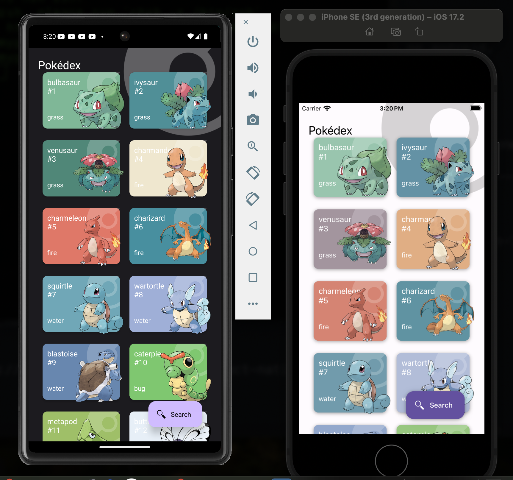
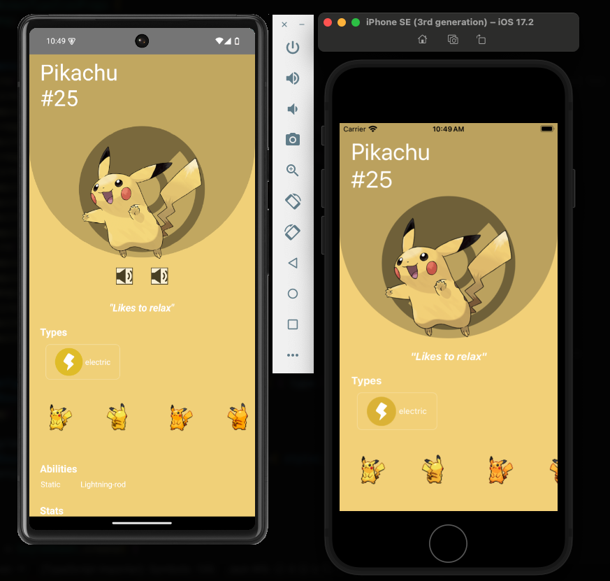
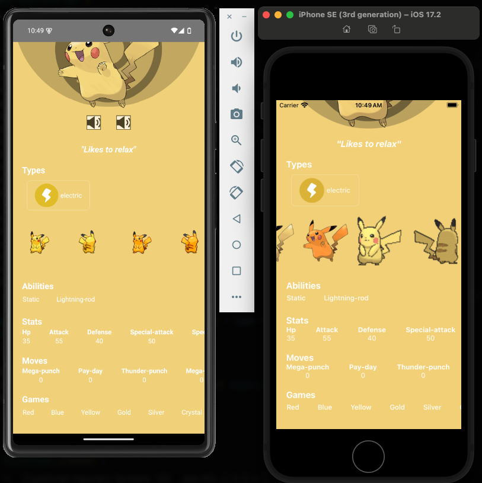

- [Pokedex App](#pokedex-app)
  * [Running this project](#running-this-project)
- [Getting Started](#getting-started)
  * [Step 1: Start the Metro Server](#step-1--start-the-metro-server)
  * [Step 2: Start your Application](#step-2--start-your-application)
    + [For Android](#for-android)
    + [For iOS](#for-ios)
  * [Step 3: Modifying your App](#step-3--modifying-your-app)
  * [Congratulations! :tada:](#congratulations---tada-)
    + [Now what?](#now-what-)
- [Troubleshooting](#troubleshooting)
- [Learn More](#learn-more)

<small><i><a href='http://ecotrust-canada.github.io/markdown-toc/'>Table of contents generated with markdown-toc</a></i></small>

# Pokedex App
This is an Pokedex App to see information about Pokemons and show usage with [tanstack/react-query](https://tanstack.com/query/latest) and [react-native-paper](https://reactnativepaper.com/) [**React Native**](https://reactnative.dev) project,  bootstrapped using [`@react-native-community/cli`](https://github.com/react-native-community/cli).

created with 
```sh
npx @react-native-community/cli@15.0.0 init pokedexApp --version 0.76
```

## Running this project





To run this project , assuming you have all android and ios running (emulators) 

If not installed install [brew](https://brew.sh/)

> Install brew 

With brew 
> Install rbenv with ruby min 3.3.0

```shell
brew install rbenv
rbenv install 3.3.0
```


Install nvm and node , and with nvm run 

```shell
brew install nvm
```

```shell
nvm install v20.18.0
```
inside root application folder  there is a `.nvmrc` file. Run command above to use `Node v20.18.0` version. 

```shell
nvm use 
``` 
> With npm

Then install [yarn](https://classic.yarnpkg.com/lang/en/docs/install/)

```shell
npm -g install yarn
```

And then build deps
```shell
npm install
npx pod-install
nmp start
```

pod install will use ruby version 3.3.0 because of the file `.ruby-version`


Follow react-native cli with `a` to start android and then `i` to start ios. You will see something like `./repository_media/project_result.png`

# Getting Started

>**Note**: Make sure you have completed the [React Native - Environment Setup](https://reactnative.dev/docs/environment-setup) instructions till "Creating a new application" step, before proceeding.

## Step 1: Start the Metro Server

First, you will need to start **Metro**, the JavaScript _bundler_ that ships _with_ React Native.

To start Metro, run the following command from the _root_ of your React Native project:

```bash
# using npm
npm start

# OR using Yarn
yarn start
```

## Step 2: Start your Application

Let Metro Bundler run in its _own_ terminal. Open a _new_ terminal from the _root_ of your React Native project. Run the following command to start your _Android_ or _iOS_ app:

### For Android

```bash
# using npm
npm run android

# OR using Yarn
yarn android
```

### For iOS

```bash
# using npm
npm run ios

# OR using Yarn
yarn ios
```

If everything is set up _correctly_, you should see your new app running in your _Android Emulator_ or _iOS Simulator_ shortly provided you have set up your emulator/simulator correctly.

This is one way to run your app — you can also run it directly from within Android Studio and Xcode respectively.

## Step 3: Modifying your App

Now that you have successfully run the app, let's modify it.

1. Open `PokedexApp.tsx` in your text editor of choice and edit some lines.
2. For **Android**: Press the <kbd>R</kbd> key twice or select **"Reload"** from the **Developer Menu** (<kbd>Ctrl</kbd> + <kbd>M</kbd> (on Window and Linux) or <kbd>Cmd ⌘</kbd> + <kbd>M</kbd> (on macOS)) to see your changes!

   For **iOS**: Hit <kbd>Cmd ⌘</kbd> + <kbd>R</kbd> in your iOS Simulator to reload the app and see your changes!

## Congratulations! :tada:

You've successfully run and modified your React Native App. :partying_face:

### Now what?

- If you want to add this new React Native code to an existing application, check out the [Integration guide](https://reactnative.dev/docs/integration-with-existing-apps).
- If you're curious to learn more about React Native, check out the [Introduction to React Native](https://reactnative.dev/docs/getting-started).

# Troubleshooting

If you can't get this to work, see the [Troubleshooting](https://reactnative.dev/docs/troubleshooting) page.

# Learn More

To learn more about React Native, take a look at the following resources:

- [React Native Website](https://reactnative.dev) - learn more about React Native.
- [Getting Started](https://reactnative.dev/docs/environment-setup) - an **overview** of React Native and how setup your environment.
- [Learn the Basics](https://reactnative.dev/docs/getting-started) - a **guided tour** of the React Native **basics**.
- [Blog](https://reactnative.dev/blog) - read the latest official React Native **Blog** posts.
- [`@facebook/react-native`](https://github.com/facebook/react-native) - the Open Source; GitHub **repository** for React Native.
